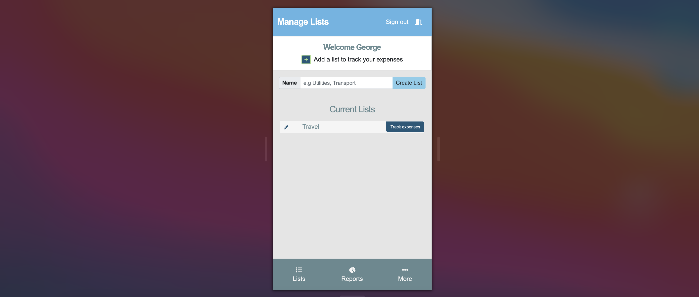
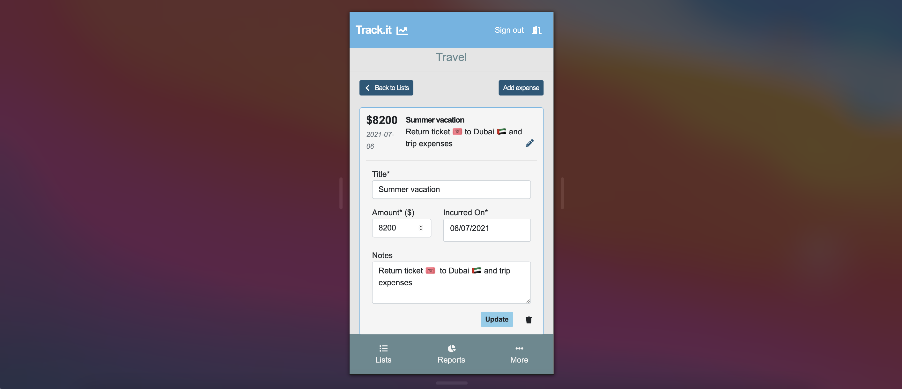

# Expense Tracker

## Live Link
[Get started with Expense Tracker](https://redux-expense-tracker.netlify.app/)
## Objectives
- Data management in front-end components
- Handling lifecycle methods and resuable logic with React Hooks
- Using client side routes with React Router
- Interacting with an API Backend
- Integrating Redux in a React application
- Structuring a Redux store
- Using React Redux Hooks
- Managing async workflows with Redux Sagas
- Functional Programming
- Meeting model client requirements

## Features
A single page application that allows users to track expenses. It largely follows the design idea by [Gregoire Vella](https://www.behance.net/gallery/13271423/Bodytrackit-An-iOs-app-Branding-UX-and-UI) on Behance. _Expense Tracker_ is primarily designed for mobile devices but support is available for larger screen sizes. To get started, `Sign up` to access the application. Three **main pages** are available to signed in users. The `Lists` page allows for managing lists of expenses if any. Clicking on `Track expenses` opens up a `Track.it` page with information about expenses in a given list. Expenses can be added, edited and deleted as desired. The `Reports` page shows an overview of users' expenditure while the `More` page allows users to edit their profile. _Expense Tracker_ is deployed on Netlify.

_Sign up or log in to access the app_

_Editing an expense_

## Prerequisites
- Internet Connection
- An Integrated Development Environment
- Chrome, Firefox or Safari across all screen sizes
- Node Package Manager [(NPM)](https://docs.npmjs.com/about-npm)

## Built With
- React
- React Router v6
- Redux
- Redux Saga
- Javascript ES6+
- npm packages
- Bootstrap 5
- SCSS
- HTML5/CSS3

## Getting Started
- Clone this project by running `git clone https://github.com/george-swift/expense-tracker.git`
- Run `npm install` to install the required dependencies.
- After installing all dependencies, run `npm start` to fire up a local server with live reloading.
- If not already redirected, visit `http://localhost:3000/` in your browser to use _Expense Tracker._
- To terminate the server, enter `Ctrl + C` in your terminal.
- To get a production bundle, run `npm run build`

## Testing
Run `npm test` to get a verbose test report.

## Authors

👤 &nbsp; **Ubong George**
- LinkedIn: [Ubong George](https://www.linkedin.com/in/ubong-itok)
- Twitter: [@\_\_pragmaticdev](https://twitter.com/__pragmaticdev)
- GitHub: [@george-swift](https://github.com/george-swift)

## Acknowledgments

- [Design idea](https://www.behance.net/gregoirevella)
- [React](https://reactjs.org/)
- [Redux](https://redux.js.org/api/api-reference)
- [Microverse](https://www.microverse.org/)

## Show your support

Leave a :star:️ &nbsp; if you like this project!

## License

Available as open source under the terms of the [MIT License](https://opensource.org/licenses/MIT).